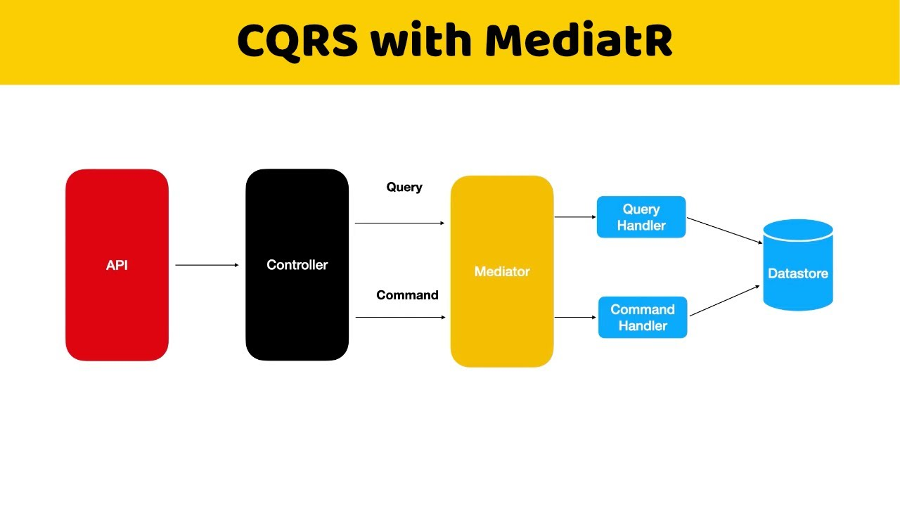

CQRS (Command Query Responsibility Segregation) y MediatR son patrones de arquitectura que se complementan 
y se utilizan juntos para mejorar la escalabilidad y la separación de responsabilidades en un sistema.
 CQRS se enfoca en separar las operaciones de lectura y escritura en dos modelos distintos, mientras que 
MediatR se enfoca en la gestión de comandos y solicitudes de manera eficiente. Juntos, estos patrones 
ayudan a garantizar que las operaciones de lectura y escritura se manejen de manera separada y escalable en el sistema.

https://codewithmukesh.com/blog/cqrs-in-aspnet-core-3-1/

>Install-Package Microsoft.EntityFrameworkCore

>Install-Package Microsoft.EntityFrameworkCore.Relational

>Install-Package Microsoft.EntityFrameworkCore.SqlServer
>Install-Package MediatR

>Install-Package MediatR.Extensions.Microsoft.DependencyInjection

>Install-Package Swashbuckle.AspNetCore

>Install-Package Swashbuckle.AspNetCore.Swagger

CORSQ with Mediat Vs Patron Repository

El repository solo contiene Get,Add,Create,Delete y cuando se deba actualizar sera un pedo
Con Mediat se puede tener mas libertad